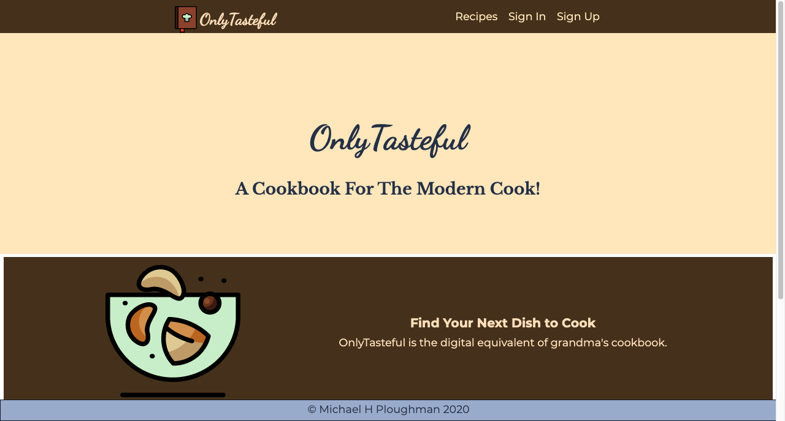
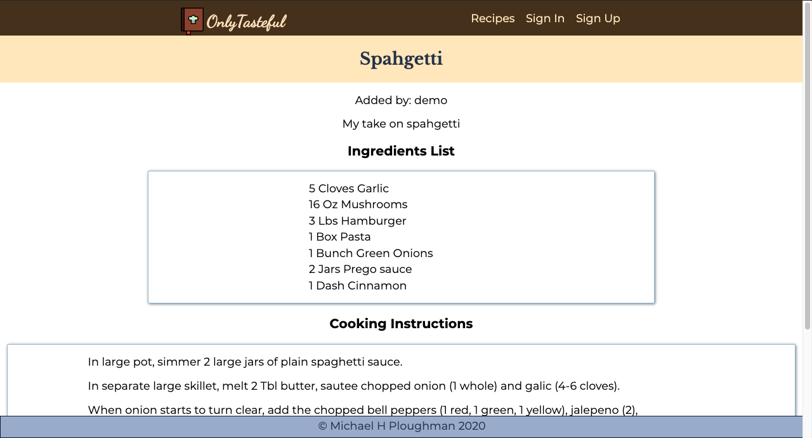

# OnlyTasteful

Find it live at:[https://only-tasteful.now.sh/]](https://only-tasteful.now.sh/)
A cook book for the modern cook. 

## Summary

This project is a solution to keeping one's recipes in a basic note taking
app. This is a purpose built app for collecting recipes, modifying them, noting changes you've tried, ect.

## Screenshots

## Client Built With

* [React](https://reactjs.org/) - The web framework used
* [CSS](https://www.w3.org/Style/CSS/Overview.en.html) - Styling done in pure CSS, specifically using Flexbox and media queries.
* [Zeit.co](https://zeit.co/) - Client deployed to Zeit, using the now CLI tool. 

## Authors

* **Michael H Ploughman** - *Initial work* - [Evoxus](https://github.com/Evoxus)

## Acknowledgments

* Thinkful

* This project was bootstrapped with [Create React App](https://github.com/facebook/create-react-app).